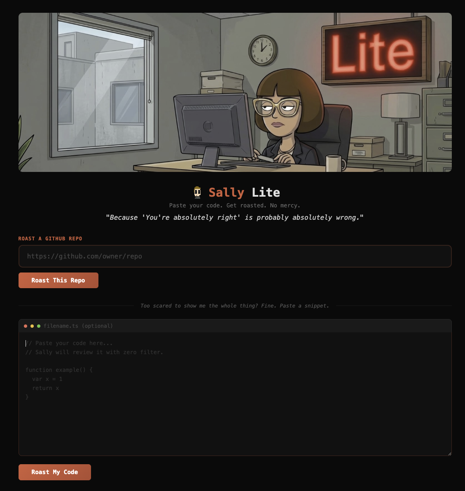
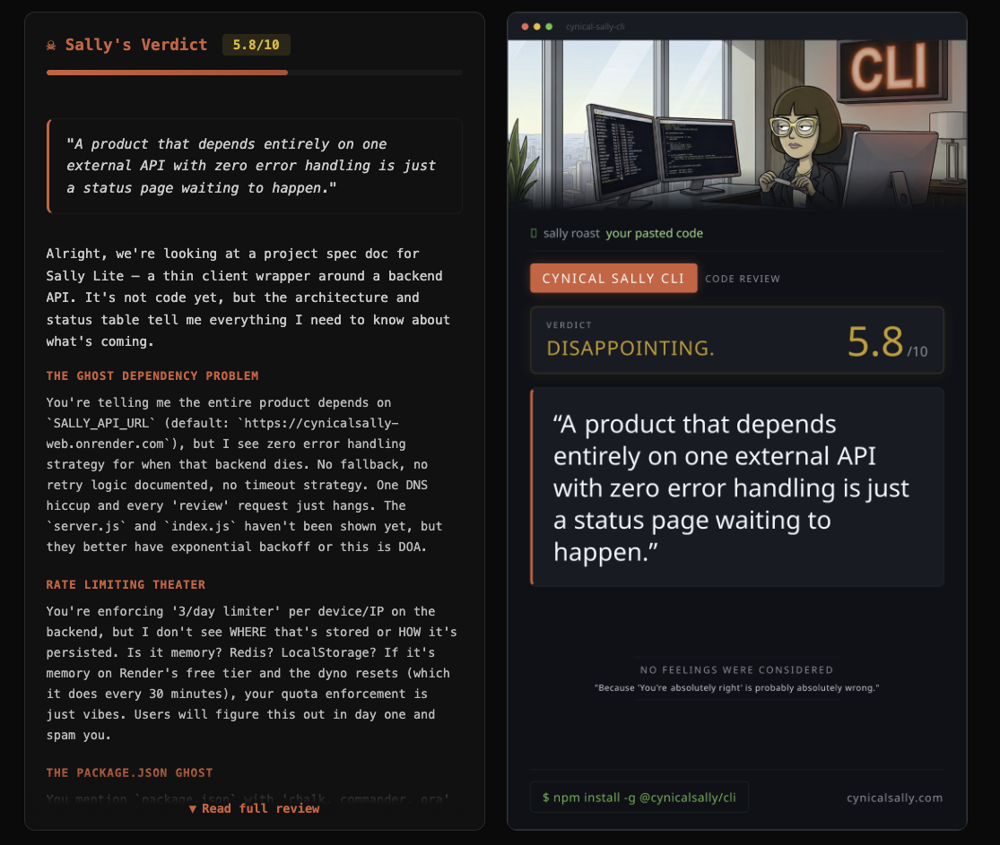

# Cynical Sally Lite


> **"Because 'You're absolutely right' is probably absolutely wrong."** - Sally

**Free code reviewer. Zero filter. Zero sugarcoating.**
Paste your code or a GitHub URL, get a brutally honest review with scores, issues, fixes, and a personality that won't hold back.

[](https://render.com/deploy?repo=https://github.com/w1ckedxt/cynicalsally-lite)

### Paste code, get roasted



### Sally delivers the verdict



---

## What is Sally Lite?

Sally Lite is a free code review tool powered by [Cynical Sally](https://cynicalsally.com). She reviews your code like a senior engineer who has time, opinions, and absolutely no reason to be polite.

Paste code or a GitHub repo URL, get roasted in your browser. Deploy it on Render in one click.

Sally Lite is a thin client. All the heavy lifting happens in Sally's back office. This repo contains no review logic, no prompts, no secrets. It just talks to the CynicalSally backend and displays the results.

---

## Features

| | |
|---|---|
| **Scoring** | 0-10 code quality score with detailed breakdown |
| **Observations** | Section-based analysis (architecture, naming, security, DRY, etc.) |
| **Issues** | Severity-tagged: critical / major / minor |
| **Fixes** | Actionable, step-by-step improvements |
| **GitHub Roast** | Paste a repo URL, Sally fetches and reviews the codebase |
| **Burncard** | Shareable PNG card with your score and Sally's hardest sneer |
| **Share on X** | One-click tweet your roast results |

---

## Quick Start

Click the Deploy to Render button above. The `render.yaml` Blueprint handles everything: service type, build command, start command, environment variables. Nothing to configure.

---

## How it works

```
Sally Lite (this repo)              Sally's Back Office
┌──────────────────────┐            ┌──────────────────────────┐
│ server.js (web UI)   │   POST     │ /api/v1/review           │
│                      │ ────────>  │ - Rate limiting          │
│ No prompts           │            │ - Device/IP quota        │
│ No review logic      │ <────────  │ - Sally's review engine  │
│ No secrets           │   JSON     │ - Scoring + issues       │
└──────────────────────┘            └──────────────────────────┘
  Open source (MIT)                   Closed backend
```

---

## Environment Variables

No manual setup needed. `SALLY_API_URL` is preconfigured in `render.yaml`. `PORT` is set by Render automatically.

---

## Limits

Sally Lite is free with daily limits (enforced by Sally's backend):

| | Sally Lite |
|---|---|
| Reviews per day | 3 |
| Mode | Quick Roast |
| GitHub repo roast | Included |
| Code paste roast | Included |

---

## Privacy

- Your code is sent to the CynicalSally backend for review
- **Code is never stored.** Processed in memory, discarded after response
- No telemetry beyond anonymous usage counts
- Device ID stored locally for rate limiting only

---

## Want the full experience?

Sally Lite is a free taste. The **Full Suite CLI** unlocks everything:

- 6 specialized tools (roast, explain, refactor, brainstorm, frontend, marketing)
- Unlimited daily reviews
- 0-10 scorecard with evidence-backed issues
- Downloadable PDF reports
- SuperClub: Chrome Extension + web access
- No ads, no sugarcoating

**[Get the Full Suite CLI](https://github.com/w1ckedxt/cynicalsally-cli)**

---

## Render Blueprint

This repo includes [`render.yaml`](render.yaml) for one-click deployment as a Render Web Service (free tier, Frankfurt region, health check included).

## License

MIT - see [LICENSE](LICENSE)

---

Thomas Geelens 2026
